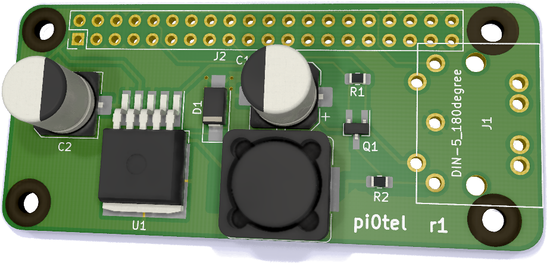

# 3615 pi0

This uHat is designed to plug on top of a pi0 or pi0-w.
It's designed to plug to the DIN-5 at the back of a Minitel-2.
The pi0 will be powered by the Minitel through the Buck converter on
the hat. TX and RX will be level-shifted to the right level on the pi's UART.

The aim is to plug the resulting dongle into a Minitel, and get instant linux.

3615 pi0 (or shall we say, 31415 Minitel).

# Reference

* https://niteshbharadwaj.github.io/posts/raspi_from_battery.html
* http://pila.fr/wordpress/?p=361
* http://www.jelora.fr/post/2020/02/25/Adaptateur-prise-DIN-peri-informatique-Minitel-vers-Serie-RS232-et-Serie-USB.html
* https://www.ti.com/lit/ds/symlink/lm2596.pdf
* https://www.edn.com/pcb-layout-tips-for-thermal-vias/
* https://www.instructables.com/id/Arduino-to-RPi-three-ways-to-convert-5-volts-to-33/
* https://randomnerdtutorials.com/how-to-level-shift-5v-to-3-3v/

# Notes

* Cin and Cout
  - should both have short leads to lm2596
  - should both have low ESR (e.g. high V rating, Nichicon PL, 1.25*Vin = 10V)
  - Ripple current rating 50% of DC load (500mA in our case)
* Cin 270uF or 330uF
* Cout 470/25 Pana or 560/16 Nichi
* Diode
  - current rating = 1.3*load = 800mA
  - reverse V rating = 1.25*Vinmax = 10V
* Heat pad should at least be 0.4"²
* L choice see page 20 of Datasheet
  - L21/L22

||uH|A|SCHOTT|SCHOTT|RENCO|RENCO|PULSE|PULSE|COILCRAFT|
|-|--|-|------|------|-----|-----|-----|-----|---------|
|L21|68|0.99|67144070|67144450|RL-5471-5|RL1500-68|PE-53821|PE-53821-S|DO3316-683|
|L22|47|1.17|67144080|67144460|RL-5471-6|—|PE-53822|PE-53822-S|DO3316-47|

* If we want low output ripple we can add post ripple filter 1uH-5uH
  with low DC Resistance and low ESR cap

